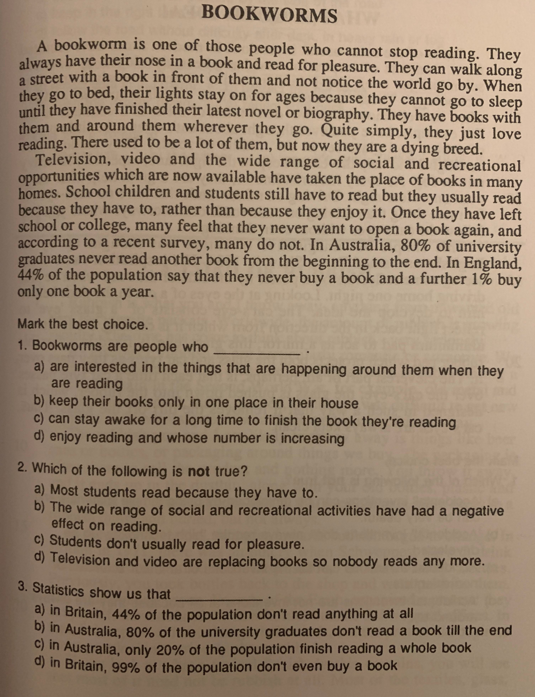
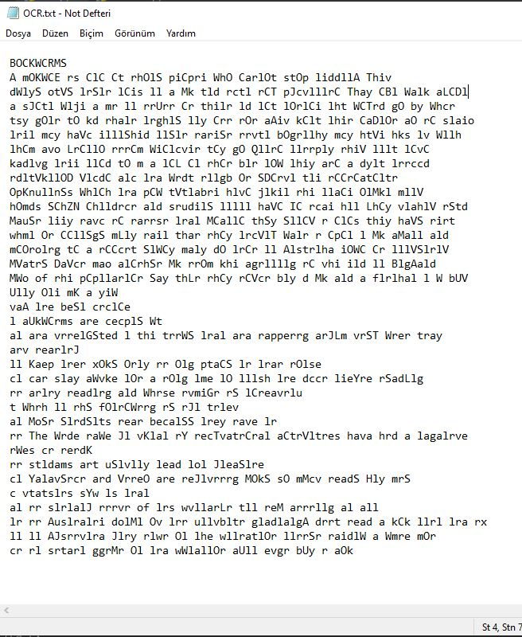

# OCRApplicationToBookPage
This application was developed with a machine learning model. 
It preprocesses the sample book page, separates it into lines, words and letters, and also sorts them. 
It writes them in a txt file in page order.

##Sample Book Page and Txt Output

